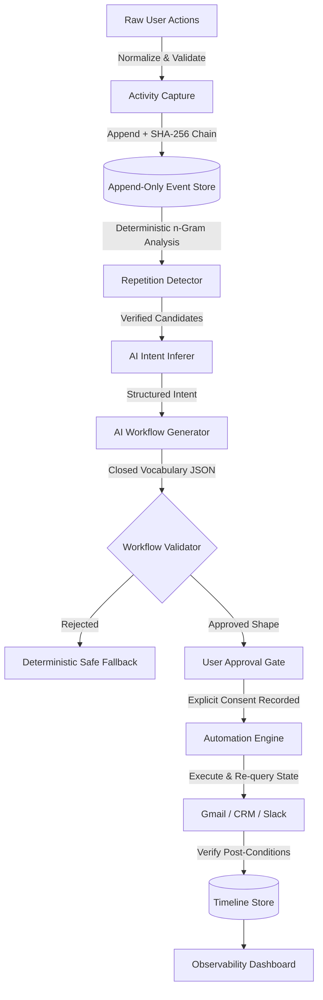

# WorkFlowOS ⚡

> **Self-Synthesizing Workflow Automation with Cryptographic Auditability & Post-Condition State Verification**  
> *Built for CMRIT Hackathon*

[](https://github.com/Pratyush-3112/workflowos)
[](LICENSE)
[](https://python.org)

---

## 💡 The Problem

Knowledge workers repeat multi-app tasks every day (**Email → Browser → CRM → Slack**), manually copy-pasting data across systems. Existing automation tools (Zapier, Make, UiPath) require the user to already know, configure, and maintain complex integration graphs.

**WorkFlowOS flips this paradigm:**
It passively observes regular digital work, detects repeating multi-app sequences, infers human business intent using an LLM, generates a structured executable workflow, requires explicit human consent, and executes with per-step post-condition state verification.

```
Observe ➔ Understand ➔ Detect Repetition ➔ Generate Workflow ➔ User Approval ➔ Automate ➔ Verify
```

---

## 🛡️ Core Differentiator: Verification Is Not Optional Testing

Every module in WorkFlowOS proves its operations:
1. **Schema-Valid Ingestion**: Raw inputs are normalized into immutable, frozen `ActivityEvent` models with closed vocabulary checks.
2. **Cryptographic Sequence Integrity**: Append-only `EventStore` maintains a SHA-256 hash chain (`prev_hash` + canonical serialized payload). History cannot be forged.
3. **No Hallucinated History**: Discovered repetition candidates cryptographically prove that every step actually occurred contiguously in real stored logs.
4. **Constrained AI Boundary**: The LLM *never* executes code or invents action types. It produces JSON strictly restricted to our closed vocabulary (`READ_EMAIL`, `DOWNLOAD_ATTACHMENT`, `SEARCH_CUSTOMER`, `UPDATE_CUSTOMER`, `SEND_SLACK_MESSAGE`).
5. **Mandatory User Consent Gate**: Workflows are hashed (`workflow_hash`). The engine strictly refuses to run without recorded user consent and detects any post-approval tampering.
6. **Per-Step Post-Condition State Verification**: The automation engine queries real external system state after every step. If a CRM field update fails, execution safely enters a `PAUSED` state and surfaces computed state diffs—never fabricating success.

---

## 🏛️ System Architecture



---

## 🔄 The Golden Workflow & Real vs. Mocked Matrix

**Workflow**: `Gmail` (Read invoice email) ➔ `Gmail` (Download attachment) ➔ `CRM` (Find customer) ➔ `CRM` (Update status to PROCESSED) ➔ `Slack` (Notify team channel).

| Component | Status | Implementation Details |
|---|---|---|
| **Deterministic Repetition Detection** | **REAL** | n-gram sliding window with temporal gating (`max_step_gap=300s`) |
| **Event History Audit** | **REAL** | SHA-256 hash-chain verification proving zero hallucinated history |
| **AI Intent Understanding** | **REAL** | OpenAI API (`gpt-4o-mini`) with JSON Mode + single-retry self-repair |
| **Workflow Generation** | **REAL** | Structured workflow generation enforced against closed vocabulary |
| **User Approval & Tamper Gate** | **REAL** | SHA-256 workflow fingerprinting; rejects altered workflows |
| **Slack Integration** | **REAL** | Real Slack Web API (`chat.postMessage`) when token configured; simulated fallback for local tests |
| **Gmail Connector** | **MOCKED** | Stateful mock inbox (realistic fixture avoiding OAuth setup risk) |
| **CRM Connector** | **MOCKED** | Stateful mock customer DB (realistic fixture avoiding OAuth setup risk) |
| **Post-Condition State Verification** | **REAL** | Queries real connector state; compares `expected_state` vs `actual_state` |

---

## 🚀 Quickstart

### 1. Setup Environment
```bash
git clone https://github.com/Pratyush-3112/workflowos.git
cd workflowos

# Environment is already configured with .venv, or initialize:
python3 -m venv .venv
source .venv/bin/activate
pip install -r requirements.txt
```

### 2. Run Full Test Suite (59 Automated Tests)
```bash
.venv/bin/pytest -v
```
*Zero external network calls required. All unit, integration, and E2E tests run in under 0.5 seconds.*

---

## 🎮 How to Demo (2 Options)

### Option A: Interactive Web Dashboard (Recommended for Judges)
Start the server:
```bash
./run.sh
# or: .venv/bin/uvicorn backend.api.main:app --host 127.0.0.1 --port 8000
```
Open **[http://127.0.0.1:8000](http://127.0.0.1:8000)** in your browser:
1. Click **`⚡ 1. Simulate 3 Runs (Detection)`**: Simulates user activity; the detector instantly identifies the 5-step pattern (80% confidence, verified).
2. Click **`🧠 2. AI Infer & Generate`**: LLM infers the business intent (*"Sync Customer Invoices to CRM & Slack"*) and generates a parameter-templated workflow.
3. Click **`✅ Approve & Execute`**: Records user consent and executes the live 4th run. All 5 steps turn green with verified computed state.
4. Click **`⚠️ 4. Trigger Mid-Flow Verification Failure`**: Injects a CRM write failure. Demonstrates how the system pauses safely at Step 4, surfaces the exact state mismatch, and skips Step 5 to prevent false notifications.

---

### Option B: Standalone Terminal Demo Runner
Run the complete, colorized 6-phase demo in the CLI:
```bash
PYTHONPATH=. .venv/bin/python scripts/demo_cli.py
```

---

## 📂 Project Structure

```
workflowos/
├── backend/
│   ├── events/               # ActivityEvent schema & SHA-256 append-only EventStore
│   ├── capture/              # Raw action normalization & persistent CaptureService
│   ├── discovery/            # WorkflowCandidate & deterministic RepetitionDetector
│   ├── ai/                   # Thin LLMClient, IntentInferer & WorkflowGenerator
│   ├── workflows/            # Workflow schemas, WorkflowValidator & ApprovalStore
│   ├── execution/            # AutomationEngine, TimelineStore & Connectors
│   │   └── connectors/       # Slack (Real/Mock), CRM (Mock), Email (Mock)
│   └── api/                  # FastAPI backend service
├── frontend/                 # Rich single-page glassmorphic dashboard UI
├── scripts/                  # demo_cli.py interactive terminal runner
├── tests/
│   ├── unit/                 # Pure unit tests (schema, detector, validator, engine)
│   ├── integration/          # API & persistence tests
│   └── e2e/                  # Full 7-stage golden workflow end-to-end tests
├── requirements.txt
├── pytest.ini
└── run.sh
```

---

## 🏆 Hackathon Pitch Cheatsheet

- **Core Insight**: Users shouldn't program robots; robots should observe users and ask for permission to take over repetitive work.
- **Why It Wins**:
  - Unlike prompt-wrapper demos, WorkFlowOS has **hard architectural guardrails**.
  - The LLM cannot hallucinate actions—it is bound by a closed vocabulary and a strict validator.
  - Cryptographic tamper protection prevents workflows from being secretly modified between approval and execution.
  - Post-condition state verification proves state changed in reality before claiming success.
